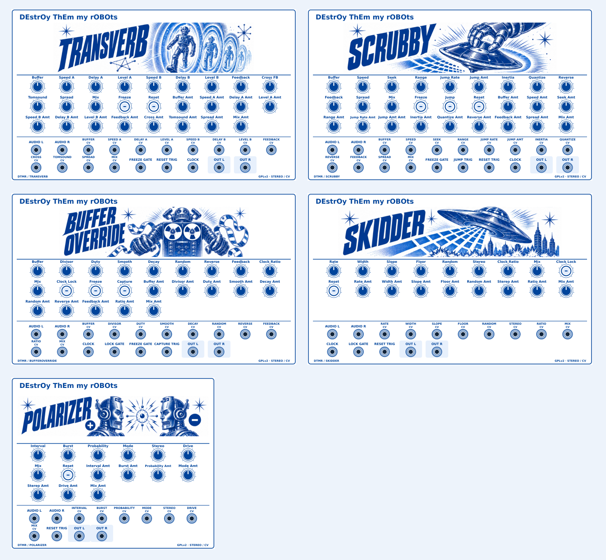

# DEstrOy ThEm my rOBOts

Five clocked stereo effects for **VCV Rack 2 / Apple Silicon**, with cobalt-blue
1950s sci-fi faceplates. GPL-2.0-only; see [licensing](LICENSING.md).



This is a complete source repository, not a precompiled Mac plugin. The
included GitHub Actions workflow builds it into an installable `.vcvplugin`.
No nested source ZIP, submodules, private SDK credentials or MetaModule build.
Unzip the repository package before uploading it to GitHub.

## Build with GitHub Desktop

1. Unzip the package. In GitHub Desktop choose **File → Add Local Repository**
   and select the extracted `DEstrOy_ThEm_my_rOBOts_GitHub` folder.
2. If Desktop says it is not a Git repository, choose **create a repository
   here**. Keep the supplied files; do not replace the supplied licence.
3. Commit the files and click **Publish repository**. The repository root
   must show `Makefile`, `plugin.json`, `src`, `res` and `.github` directly,
   not inside an extra enclosing folder. All source is already unzipped.
4. Open the repository on GitHub. Under **Actions**, open **Build robots -
   VCV Apple Silicon**. It runs on pushes to main/master, or select **Run
   workflow** after it is present on your default branch.
5. When the run succeeds, download **Robots-2.1.0-VCV-mac-arm64-and-source**
   from the run's **Artifacts** section and unzip that download once.
6. Install the enclosed `.vcvplugin`, not the GitHub source ZIP: copy it into
   the `plugins-mac-arm64` folder inside Rack's user folder, then restart Rack.
   Open Rack's user folder through **Help → Open user folder**. Run native
   Apple Silicon Rack, not an Intel/Rosetta version.

Search the module browser for **DEstrOy ThEm my rOBOts**. The source ZIP in
the build artifact is for sharing/rebuilding, not for installation.

## New identity — separate from DestroyFX

Plugin slug: `DestroyThemMyRobots`.

| Display module | New module slug |
| --- | --- |
| Transverb | DTMR-Transverb |
| Scrubby | DTMR-Scrubby |
| Buffer Override | DTMR-BufferOverride |
| Skidder | DTMR-Skidder |
| Polarizer | DTMR-Polarizer |

The renamed plugin can coexist with DestroyFX. Existing DestroyFX patches
will **not** automatically load this version. This deliberately changes the
identifiers at the user's request. Parameter IDs, order and normalized values
remain unchanged, but panel positions have been redesigned. Existing MM
plugins still have their old identifiers and will not recognise these new
modules. This repository does not update or build MM.

The production panels adapt the approved concept to include **every** control,
amount knob, trigger, gate and CV input from the supplied source. Artistic
headers are separated from exact labels. The raster panels are rendered at
twice Rack's logical resolution and loaded through Rack's image API, avoiding
SVG embedded-image compatibility issues. Blue controls are actual widgets,
not fake controls baked into the faceplates.

## Local build and development

Download the official Rack SDK 2.6.6 for your host/architecture. With `make`,
a C++17 compiler, `jq` and `zstd` available:

```sh
export RACK_DIR=/absolute/path/to/Rack-SDK
python3 scripts/validate.py
bash scripts/test-dsp.sh
make -j3 dist
```

GitHub downloads the pinned SDK automatically. Normal compilation does not
need Inkscape, Python imaging packages or image generation. All production
assets are checked in. Only artwork regeneration needs Inkscape and a local
DejaVu Sans installation:

```sh
python3 scripts/prepare_design.py
python3 scripts/preview.py
```

`design/header-atlas.png` is the editable raster source, `design/panels/*.svg`
are layout sources and `scripts/prepare_design.py` specifies the header
viewports and all functional labels. The original concept is retained too.
Raster illustrations are not misrepresented as editable vector drawings.

See [VALIDATION.md](VALIDATION.md) for what has and has not been tested.
See [CONTROL_GUIDE.md](CONTROL_GUIDE.md) and [CLOCK_SYNC_GUIDE.md](CLOCK_SYNC_GUIDE.md)
for the inherited effect controls; legacy brand references there mean this
unchanged portable DSP, not an MM build included here.
